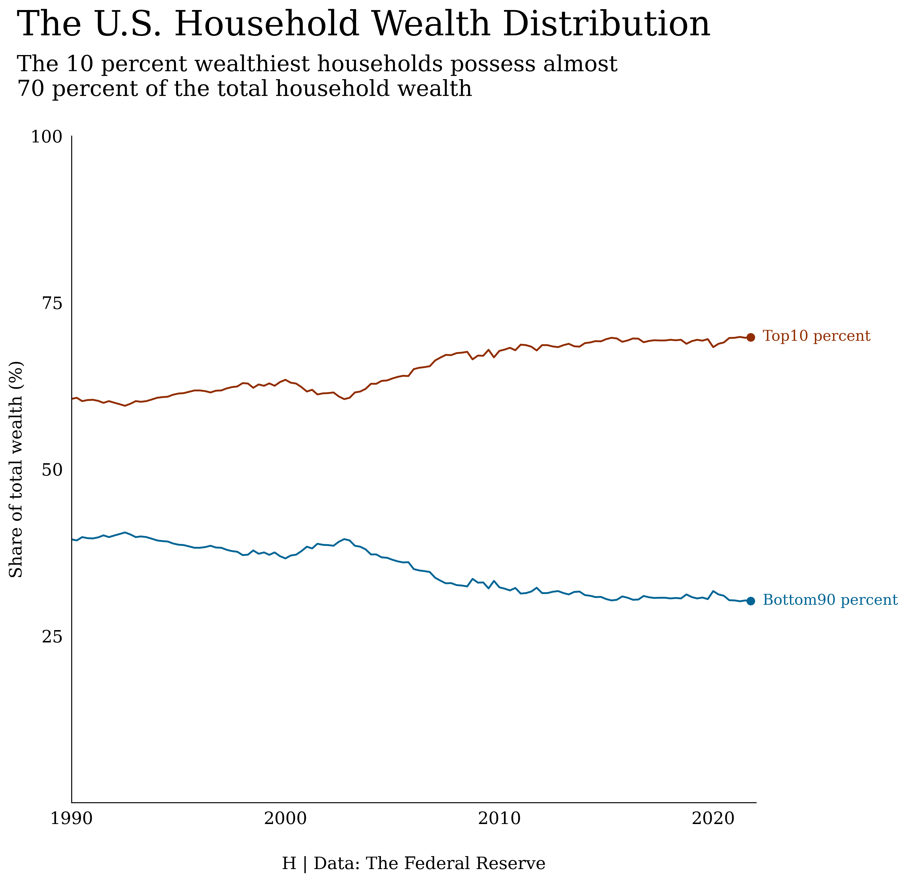

# Data Visualization

### [Maximum Rainfall in Hong Kong by Year (1947-2022)](https://github.com/hckkiu/data-viz/tree/main/rainfall)

---

### [Global Temperature (1835 - 2015)](https://github.com/hckkiu/data-viz/tree/main/temperature)

---

### [Salaries of NBA Teams (2001-2021)](https://github.com/hckkiu/data-viz/tree/main/nba)

---

### [Effectiveness of inbound exchange](https://github.com/hckkiu/data-viz/tree/main/exchange)

---

### [The U.S. Household Wealth Distribution](https://github.com/hckkiu/data-viz/tree/main/wealth)

